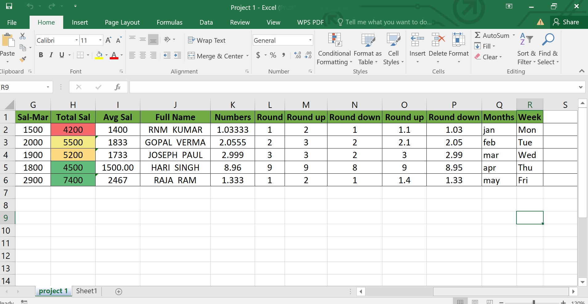

## 🧩 Module 1 : Introduction à l’analyse de données

### 🎯 Objectifs du module
- Comprendre ce qu’est l’analyse de données et son utilité.
- Découvrir les grandes étapes d’un projet d’analyse.
- Se familiariser avec les types de données et les contextes d’application.

---

### 📘 Contenu

#### 1.1 Définitions fondamentales
- ##### Les Données:
Une donnée est une information factuelle qui est connue et qui sert de point de départ à un raisonnement dans le but de trouver une solution en relation avec celle-ci. Les données sont générées par un processus générateur de données à différents échelles. Avec le développement des IOT, des objects connectés comme les smartphones, des quantités importantes de données sont générées et elles servent de matière première au déploiement de solutions guidées par la donnée comme les application d'intelligence artificielle, les chatbot comme chat gpt, deepseek, grok. Elles servent encore au marketing ciblé dans sein des entreprises durant les opérations de communication mais elles sont aussi utilisées par les plateformes de publicité digitales pour affiner la publicité sur les réseaux sociaux. 
Les données sont généralement disponibles sous divers formats : le plus populaire est le csv, mais elles sont souvent aussi sous format excel ou disponibles directement depuis les bases de données

-##### Variable:
Une variable est un ensemble d'observations représenté en colonne. Traditionnement on décline une variable selon qu'elle soit quantitative ou qualitative. Une variable quantitative contient des chiffres alors qu'une variable qualitative contient des modalités ou items. 
Sur notre exemple la variable Total Sal est quantitative alors Full Name est qualitative
- ##### Population:
En statistique le terme population désigne l'ensemble de tous les individus. Cet ensemble peut être de taille finie(l'ensemble des élèves d'une classe) ou de taille infinie ou indéfinie parce qu'il est impossible d'en faire une étude exhaustive(ensemble des personnes présentant un caractère génétique particulier)
- ##### Echantillon:
Un échantillon est un sous-ensemble de n individus(d'effectif n) qu'on a extrait d'une population pour laquelle on a mesuré un caractère quantitatif ou qualitatif donné
- ##### Données structurées vs non structurées.

#### 1.2 Pourquoi analyser les données ?
- Exemples d’utilisation dans différents secteurs (santé, marketing, finance, etc.)
- La place de l’analyse de données dans la prise de décision.

#### 1.3 Le cycle de vie d’un projet d’analyse de données
- Étapes : définition du problème → collecte → nettoyage → exploration → modélisation → communication.
- Illustration à travers un mini-cas concret.

#### 1.4 Étude de cas introductive (activité)
- Jeu de données simple (ex. : ventes mensuelles d’un magasin).
- Questions guidées : que contient ce jeu de données ? Que peut-on en déduire ?
- Discussion en groupe ou individuelle.

---

### 🛠 Outils utilisés
- Tableur (Excel ou Google Sheets)
- Visualisation simple (graphique en barres ou histogramme)

---

### 📌 Évaluation formative
- QCM rapide sur les notions clés vues en cours.
- Mini-rédaction : expliquer en quelques phrases ce qu’est l’analyse de données et à quoi elle sert.

---

### 📝 Ressources complémentaires
- Article : *"What is Data Analysis?"* (Khan Academy / Towards Data Science)
- Vidéo introductive (ex. YouTube ou MOOC)

